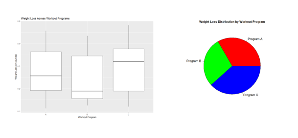

# Weight-Loss-Analysis

# Problem Statement:
A fitness center wants to determine if there is a significant difference in the average response time of three different workout programs. the data is stored in a CSV file named "weight_loss_data.csv" (source: kaggle) with the following columns: Workout_Program(A, B, or C), Participent_ID, and Weight_loss(in pounds) . Design an ANOVA experiment in R to analyze the data and determine if there is a significant difference in the average weight loss across the three workout programs.

# R Programming:
R programming is a statistical programming language and software environment for statistical computing and graphics. It is widely used among statisticians and data miners for developing statistical software and data analysis. R provides a wide variety of statistical and graphical techniques, including linear and nonlinear modeling, time-series analysis, and clustering, among others. It also allows for easy integration with other programming languages and data sources, making it a powerful tool for data analysis and visualization. R is open source and free to use, which has contributed to its widespread adoption in the data science community.

# ANOVA Experiment:
ANOVA (Analysis of Variance) is a statistical method used to determine whether there are any statistically significant differences between the means of two or more groups. An ANOVA experiment involves comparing the variation between groups to the variation within groups, to determine if the variation between groups is large enough to suggest that there is a significant difference in the means.
The ANOVA test generates an F-statistic, which measures the ratio of between groups variation to within groups variation. If the F-statistic is large and the associated p-value is small, we can conclude that there is a significant difference between the groups being compared.

# Data Visualization:

